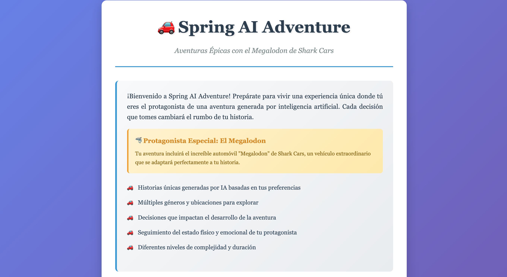

# Spring AI Adventure - Megalodon Java Sharks Cars

## Resumen
Este repositorio contiene una Prueba de Concepto (POC) de un sistema para interactuar con LLM de OpenAI usando Spring Boot / Spring AI. 

### Models
- gpt-4.1-nano
- dall-e 3
- tts
- whisper
- ada v2

## Setup Instructions
1. Clonar el repositorio
2. Package el microservicio con el comando
 ```bash
    mvn clean install
 ```
3. Hace uso de Chroma como vector store
4. Levantar el sistema con el comando
 ```bash
    docker compose up --build
 ```

## Flujo
1. Acceder a http://localhost:8080
2. Llenar el formulario para comenzar la aventura.
3. Se puede Escribir, Grabar o subir una imagen para el nombre del protagonista.
- nota: al final hay una imagen de ejemplo que se puede usar a modo de prueba.
4. Durante la aventura, tomar decisiones que afectan el desarrollo de la historia.
5. Al completar la aventura, generar resumen y audio.

## Funcionalidades

### Creación de Aventuras
- **Géneros disponibles**: Acción, Aventura, Misterio, Ciencia Ficción, Fantasía, Thriller, Supervivencia, Espionaje.
- **Personalización del protagonista**: Nombre, descripción, cantidad de protagonistas.
- **Configuración de dificultad**: Duración (Corta/Media/Larga) y Complejidad (Baja/Media/Alta).
- **Entrada multimodal**: Texto, grabación de voz, o análisis de imagen para el nombre del protagonista.

### Sistema de Aventuras Interactivas
- **Generación dinámica**: Historias únicas creadas por IA basadas en las preferencias del usuario.
- **Toma de decisiones**: Múltiples opciones en cada turno que afectan el desarrollo de la historia.
- **Estados del protagonista**: Seguimiento continuo del estado físico y emocional.
- **Integración del Megalodon**: Automóvil especial de Shark Cars integrado en cada aventura.
- **Imágenes generadas**: Visualización de escenas clave usando DALL-E 3.

### Resumen y Audio
Una vez completada la aventura, el sistema ofrece:

#### 📝 Generación de Resumen
- **Análisis inteligente**: Procesa toda la aventura completa para crear un resumen coherente.
- **Elementos clave**: Incluye decisiones importantes, momentos destacados y el desenlace.
- **Personalización**: Adaptado al estilo y género de la aventura específica.

#### 🔊 Conversión a Audio
- **Text-to-Speech**: Convierte el resumen generado a audio usando el modelo TTS de OpenAI.
- **Audio inmersivo**: Narración de alta calidad para una experiencia completa.
- **Reproducción integrada**: Player de audio embebido en la interfaz.
- **Dependencia del resumen**: Requiere que el resumen haya sido generado previamente.

### Tecnologías de IA Utilizadas
- **GPT-4.1-nano**: Generación de historias y decisiones.
- **DALL-E 3**: Creación de imágenes para escenas de la aventura.
- **Whisper**: Conversión de audio a texto para entrada de nombre por voz.
- **TTS**: Síntesis de voz para la narración del resumen.
- **Ada v2**: Embeddings para el sistema de vectores.




